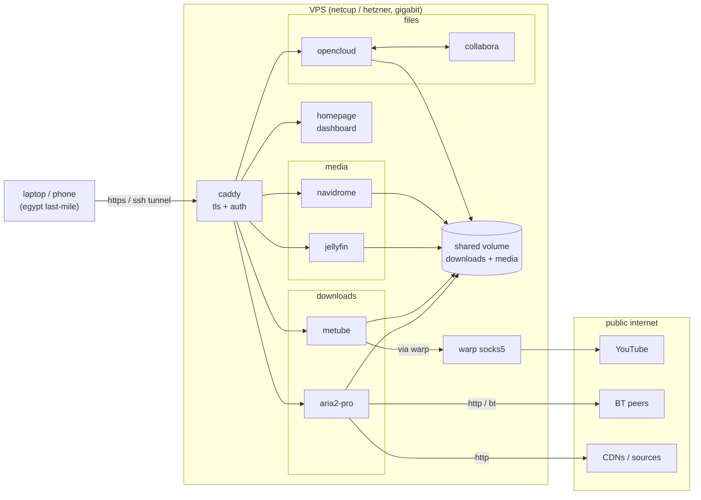

# qanat

> القناة - the underground channel that carries water across the desert.

run downloads + media on a fast vps. stream them back over a slow link.
built for egypt-tier last-mile internet.

## what's in it

- **homepage** - one dashboard linking out to everything
- **aria2-pro** + **ariang** - multi-connection http + bittorrent downloads
- **metube** - yt-dlp web ui (youtube + 1000 other sites)
- **jellyfin** - video streaming
- **navidrome** - music streaming (optional)
- **opencloud** - files, sharing, sync (eu fork of owncloud infinite scale)
- **collabora** - online office editor for opencloud (optional)
- **caddy** - tls reverse proxy with auto letsencrypt

## what you need

- a vps with **root access** and a public ipv4. providers with the bandwidth
  + peering for our use case:
  - [netcup](https://www.netcup.eu/) — rs series. cheap, lots of bandwidth.
  - [hetzner](https://www.hetzner.com/cloud) — ccx / cpx series. great peering.
- a **domain name**. don't have one? see [docs/domains.md](./docs/domains.md)
  (free options + cheap `.xyz` for $1).
- **docker** and **docker compose v2** on the vps.
- ~50 gb disk, plus whatever you want for media.

## architecture



editable diagram: [`docs/architecture.drawio`](./docs/architecture.drawio) -
open in [app.diagrams.net](https://app.diagrams.net/) or the vscode "draw.io
integration" extension.

## quick start

```bash
git clone https://github.com/Mostafa-M-Hussein/qanat.git
cd qanat
./setup.sh
$EDITOR .env

# basic-auth password for ariang/metube:
docker run --rm caddy:2-alpine caddy hash-password --plaintext 'your-pw'
# paste output into BASIC_AUTH_HASH in .env

# point dns:
#   example.com           -> homepage
#   jellyfin.example.com  -> jellyfin
#   aria.example.com      -> ariang
#   metube.example.com    -> metube
#   cloud.example.com     -> opencloud

# open firewall: 80, 443, 443/udp, 6888 (bittorrent)

docker compose up -d
```

optional add-ons:

```bash
docker compose --profile music up -d     # + navidrome
docker compose --profile office up -d    # + collabora editor
docker compose --profile warp up -d      # + warp (yt bypass)
docker compose --profile tunnel up -d    # + cf tunnel (no open ports)
```

## already running aria2 or jellyfin?

see [docs/migration.md](./docs/migration.md) - reuses your existing data
without re-downloading anything.

## license

mit. see [LICENSE](./LICENSE).
